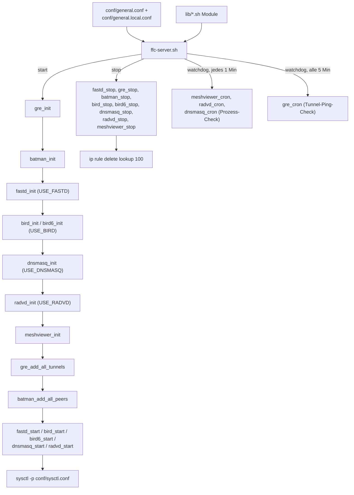

# Architektur

Dieses Repository konfiguriert und betreibt einen **Freifunk-Chemnitz-Backbone-Server**
(auch **„Uplink-Server“** genannt, siehe [Backbone-Netzwerk](backbone-netzwerk.md)):
einen Server, der als Gateway/Supernode für Freifunk-Router (Mesh-Knoten) dient und
gleichzeitig mit den anderen Backbone-Servern des Netzes verbunden ist. Das Repository ist
als Sammlung von Bash-Skripten aufgebaut, die wie ein SysV-Init-Dienst gestartet, gestoppt
und per Cron überwacht werden.

## Verzeichnisstruktur

| Pfad | Zweck |
|---|---|
| `ffc-server.sh` | Zentrales Steuerskript: `start`, `stop`, `watchdog`. Lädt Konfiguration und alle `lib/*.sh`-Module. |
| `initd-ffc.sh` | Dünner Wrapper, der `ffc-server.sh` als `/etc/init.d/ffc` einbindet (SysV-Init). |
| `lib/*.sh` | Ein Modul pro Dienst/Funktion (siehe unten). Jedes Modul stellt `<name>_init`, `<name>_start`, `<name>_stop` und optional `<name>_cron` bereit. |
| `conf/*.conf` | Eingecheckte Vorlagen/Defaults. Pro Server werden daraus `*.local.conf`-Dateien erzeugt bzw. von Hand angelegt (siehe `conf/.gitignore`: `*.local.*` ist lokal/generiert und nicht versioniert). Die BIRD-Konfiguration liegt **nicht** mehr hier, sondern im Ansible-Playbook [ffc-mash](https://github.com/FreifunkChemnitz/ffc-mash) (Rolle `ffc_vpn_gateway`, Ziel `/etc/bird/`). |

## Die Module in `lib/`

Eine ausführlichere Beschreibung jeder einzelnen Komponente (Software und Skript) samt
ihrem Zweck findet sich in [Komponenten](komponenten.md).

| Modul | Verantwortlich für |
|---|---|
| `log.sh` | Logging nach syslog (`logger`) und optional per Mail (`LOG_TO`), inkl. `log_fatal_error` zum Abbruch bei Fehlkonfiguration. |
| `gre.sh` | Aufbau der GRE-Tunnel (`gretap`) zu allen anderen Backbone-Servern aus `GRE_PEERS`; Watchdog-Check per ICMPv6-Ping auf die Tunnel-Interfaces. |
| `batman.sh` | Initialisiert `batman-adv`, hängt die GRE-Interfaces (aus `BATMAN_IFS`) und später `fastd`-Interfaces als Slaves ein, konfiguriert `bat0` (Service-Adressen, Bridge-Loop-Avoidance, Bonding, Gateway-Modus) und startet `alfred`/`batadv-vis` für die Meshviewer-Daten. |
| `fastd.sh` | Startet das fastd-VPN (einen Prozess pro CPU-Kern, jeweils auf eigenem Port), über das sich Freifunk-Router mit dem Server verbinden. |
| `bird.sh` / `bird6.sh` | Setzen das Policy-Routing (`ip rule`/`ip -6 rule` → Tabelle 100) und NAT für das Mesh-Netz und starten/stoppen die `bird`/`bird6`-Dienste (via systemd). Die BIRD-Konfiguration selbst (Router-ID, BGP-Peers, Routen) wird vom Ansible-Playbook [ffc-mash](https://github.com/FreifunkChemnitz/ffc-mash) (Rolle `ffc_vpn_gateway`) nach `/etc/bird/` gerendert. |
| `dnsmasq.sh` | DHCP/DNS für Endgeräte im Mesh (`bat0`), optional, nur auf Servern mit `USE_DNSMASQ=1`. |
| `radvd.sh` | IPv6 Router Advertisements für `bat0`, nur auf IPv6-Gateway-Servern (`USE_RADVD=1`). Die zugehörige IPv6-Default-Route in BIRD6 kommt aus der Ansible-Rolle (`ffc_vpn_gateway_bird_ipv6_uplink`). |
| `meshviewer.sh` | Startet `alfred`/`batadv-vis` unabhängig von `batman.sh`, falls der Server primär als Meshviewer-Datenquelle dient. |

## Ablauf: Start, Stop, Watchdog

`ffc-server.sh` (siehe dort) lädt zunächst `conf/general.conf` und `conf/general.local.conf`
sowie alle `lib/*.sh`-Module und verzweigt dann anhand des Arguments:

Wichtige Details zum Ablauf:

- **Reihenfolge beim Start:** Erst werden alle Dienste initialisiert (`*_init`, meist reine
  Konfigurationsgenerierung/-validierung), dann werden GRE-Tunnel und batman-adv-Peers
  aufgebaut, und erst danach die eigentlichen Daemons gestartet. So existieren die
  Netzwerk-Interfaces bereits, wenn z. B. BIRD versucht, BGP-Sessions über sie aufzubauen.
- **Feature-Flags:** `USE_FASTD`, `USE_BIRD`, `USE_DNSMASQ`, `USE_RADVD`, `USE_MESHVIEWER` in
  `general.local.conf` steuern, welche Module überhaupt aktiv werden — ein Server muss nicht
  alle Rollen gleichzeitig übernehmen (z. B. ist `USE_DNSMASQ`/`USE_RADVD` nur auf
  ausgewählten Gateway-Servern gesetzt).
- **Watchdog:** `ffc-server.sh watchdog` wird minütlich per Cron aufgerufen (siehe README).
  Jede Minute werden laufende Prozesse (dnsmasq, radvd, alfred) geprüft und bei Bedarf neu
  gestartet; alle 5 Minuten wird zusätzlich die Erreichbarkeit der GRE-Tunnel per Ping
  geprüft. Fehler werden über `log_error`/`log_fatal_error` sowohl nach syslog als auch (im
  Watchdog-Kontext) per Mail an `LOG_TO` gemeldet.
- **Konfigurations-Templating:** `dnsmasq.sh` erzeugt aus der eingecheckten
  `conf/dnsmasq.conf`-Vorlage (Platzhalter wie `__DNSMASQ_SERVICE_IP__`) bei jedem Start
  eine `*.local.conf`-Datei anhand der Werte aus `general.local.conf`. Die
  BIRD-/BIRD6-Konfiguration wird dagegen vom Ansible-Playbook
  [ffc-mash](https://github.com/FreifunkChemnitz/ffc-mash) gerendert (Rolle
  `ffc_vpn_gateway` → `/etc/bird/`), nicht mehr zur Laufzeit hier.

## Kopplung zwischen den Modulen

Die Module sind nicht unabhängig, sondern bauen aufeinander auf:

- Die Ansible-Rolle `ffc_vpn_gateway` leitet die BGP-Peers aus derselben Server-Menge
  (Inventory-Gruppe `routers`) ab wie die GRE-Vollvermaschung, sodass pro GRE-Tunnel eine
  BGP-Session zum jeweiligen Nachbarserver besteht. `bird.sh`/`bird6.sh` selbst richten nur
  das Policy-Routing (Tabelle 100) ein.
- `batman.sh` bindet die von `gre.sh` erzeugten Interfaces (`BATMAN_IFS`) sowie die von
  `fastd.sh` erzeugten Client-Tunnel in dieselbe batman-adv-Instanz (`bat0`) ein.
- `radvd.sh` erfordert `USE_BIRD=1`; die zugehörige IPv6-Default-Route in BIRD6 wird über
  die Ansible-Rolle gesetzt (`ffc_vpn_gateway_bird_ipv6_uplink`).

Das Zusammenspiel dieser Module ergibt das eigentliche Backbone-Netz — siehe
[Backbone-Netzwerk](backbone-netzwerk.md) für die konzeptionelle Erklärung.
