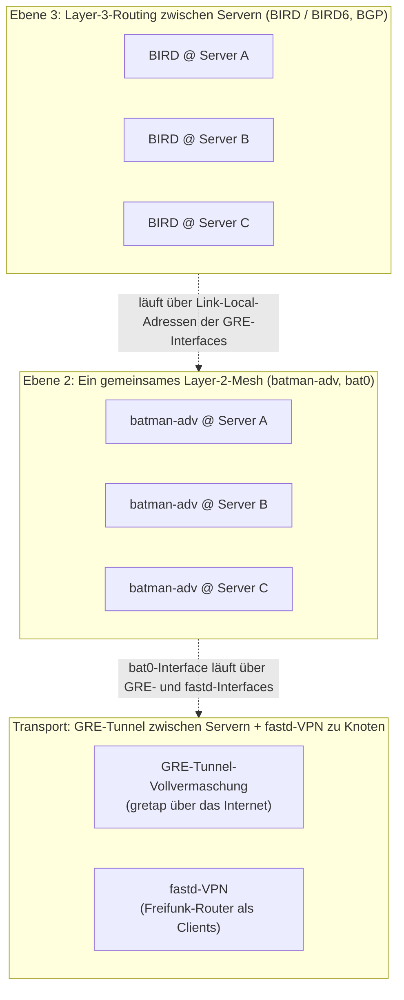

# Wie funktioniert das Freifunk-Backbone?

Ein Freifunk-Netz besteht aus zwei Ebenen: den **Mesh-Knoten** (die WLAN-Router, die
Freifunk-Firmware nutzen und sich untereinander sowie über einen VPN-Tunnel mit einem
Server verbinden) und dem **Backbone**: mehreren, geografisch verteilten Servern, die das
Netz mit dem Internet verbinden und untereinander verknüpft sind. Dieses Repository
konfiguriert genau diese Backbone-Server. Alle unten beschriebenen Bausteine entsprechen
konkreten Modulen aus [`lib/`](../lib) (siehe [Architektur](architektur.md)).

> **Hinweis:** Im Repository (z. B. in der Haupt-README) wird für dieselben Server auch der
> Begriff **„Uplink-Server“** verwendet. Beide Bezeichnungen meinen dasselbe: „Backbone“
> betont das Server-zu-Server-Netz als Ganzes, „Uplink-Server“ die Rolle des einzelnen
> Servers als Internet-Zugang für die an ihn angeschlossenen Freifunk-Router.

## Grundlagen: Was ist ein Layer-2-Netz?

Netzwerke werden häufig nach dem OSI-Modell in Schichten eingeteilt. Für das Verständnis
des Backbones sind vor allem zwei davon relevant:

- **Schicht 2 (Sicherungsschicht, „Layer 2“):** Hier werden **Ethernet-Frames** anhand von
  **MAC-Adressen** zugestellt, nicht anhand von IP-Adressen. Alle Geräte in einem
  Layer-2-Netz bilden eine gemeinsame **Broadcast-Domäne** — sie „sehen“ sich gegenseitig
  so, als wären sie über einen einzigen Switch verbunden, unabhängig davon, wie sie
  tatsächlich physisch verkabelt sind. Geräte können sich z. B. per ARP oder Broadcast
  direkt erreichen, ganz ohne Router dazwischen.
- **Schicht 3 (Vermittlungsschicht, „Layer 3“):** Hier werden **Pakete** anhand von
  **IP-Adressen** zwischen unterschiedlichen Netzen weitergeleitet (Routing). Ein
  Layer-3-Netz besteht typischerweise aus mehreren, durch Router getrennten
  Layer-2-Netzen.

Für das Freifunk-Backbone ist das zentral: **GRE- (`gretap`) und fastd-Tunnel
transportieren rohe Ethernet-Frames**, nicht IP-Pakete. Dadurch lassen sie sich direkt in
`batman-adv` einhängen, das selbst auf Schicht 2 arbeitet. Das Ergebnis ist ein einziges,
großes Layer-2-Netz (eine gemeinsame Broadcast-Domäne), das sich über alle
Backbone-Server und alle daran angeschlossenen Freifunk-Router erstreckt — obwohl die
Server geografisch verteilt und nur über das öffentliche Internet verbunden sind. Erst
darüber legt sich mit BGP/BIRD eine klassische Layer-3-Routingebene (siehe unten).

## Grundlagen: Was ist eine Vollvermaschung?

Bei einer **Vollvermaschung** (englisch *full mesh*) hat jeder Teilnehmer eines Netzes eine
direkte Verbindung zu **jedem anderen** Teilnehmer — im Gegensatz zu einer Stern-Topologie
(alle Verbindungen laufen über einen zentralen Knoten) oder einer Teilvermaschung (nur
manche Teilnehmer sind direkt verbunden, der Rest wird über Zwischenstationen erreicht).
Bei `n` Teilnehmern braucht eine Vollvermaschung `n * (n-1) / 2` Verbindungen — bei den
aktuell 8 Servern in `GRE_PEERS` sind das 28 GRE-Tunnel bzw. 28 BGP-Sessions.

Der Vorteil: Es gibt keinen Single Point of Failure und keinen Server, über den zwangsläufig
aller Verkehr laufen müsste — fällt ein Server aus, bleiben alle übrigen weiterhin direkt
miteinander verbunden. Der Nachteil ist die quadratisch wachsende Anzahl an Verbindungen,
weshalb eine Vollvermaschung nur bei einer überschaubaren Anzahl an Servern praktikabel ist;
bei sehr vielen Teilnehmern würde man stattdessen auf ein hierarchisches oder
teilvermaschtes Modell wechseln.

Im Backbone gibt es zwei unabhängige Vollvermaschungen übereinander:

- eine **GRE-Vollvermaschung** auf der Transportebene — jeder Server hat einen `gretap`-Tunnel
  zu jedem anderen (siehe „Transport“ unten), und
- eine **BGP-Vollvermaschung** auf der Routingebene — jeder Server hat eine BGP-Session zu
  jedem anderen (siehe „Ebene 3“ unten).

## Die drei Ebenen des Backbones

### 1. Transport: GRE-Vollvermaschung zwischen Servern + fastd zu den Knoten

- Jeder Backbone-Server baut zu **jedem anderen** Backbone-Server einen
  `gretap`-Tunnel auf — eine [Vollvermaschung](#grundlagen-was-ist-eine-vollvermaschung)
  (`lib/gre.sh`, Liste `GRE_PEERS`). Es handelt sich bewusst um
  **`gretap`** (GRE mit Ethernet-Framing), nicht um klassisches IP-GRE — dadurch transportiert
  der Tunnel [Layer-2](#grundlagen-was-ist-ein-layer-2-netz)-Frames und kann direkt in eine
  Bridge/batman-adv-Instanz gehängt werden.
  Jeder Server bekommt auf jedem Tunnel-Interface eine Link-Local-artige IPv4-Adresse aus
  `169.254.0.0/16` (abgeleitet aus den letzten beiden Oktetten der öffentlichen IP) sowie
  eine IPv6-Link-Local-Adresse (`fe80::ffc:…`) — diese Adressen dienen ausschließlich als
  Endpunkte für die spätere BGP-Session, nicht dem eigentlichen Mesh-Verkehr.
- Freifunk-Router (Endgeräte) bauen stattdessen ein **fastd**-VPN zum Server auf
  (`lib/fastd.sh`). fastd ist ebenfalls ein [Layer-2](#grundlagen-was-ist-ein-layer-2-netz)-VPN
  (`mode multitap`); jedes neue
  Client-Interface wird beim Verbindungsaufbau automatisch per `batctl interface add`
  in batman-adv eingehängt (siehe `on up`-Hook in `conf/fastd.conf`).
- Damit transportieren sowohl GRE- als auch fastd-Tunnel **Ethernet-Frames über das
  Internet** — beide sind reine Transportstrecken für die nächste Ebene. Welche der beiden
  Strecken verschlüsselt ist und welche nicht, beschreibt das
  [Sicherheitsmodell](sicherheitsmodell.md).

### 2. Ebene 2: Ein einziges großes Mesh über batman-adv

- `lib/batman.sh` hängt sowohl die GRE-Interfaces zu den anderen Servern
  (`BATMAN_IFS`) als auch die dynamisch entstehenden fastd-Client-Interfaces in
  **eine gemeinsame batman-adv-Instanz** (`bat0`).
- Das Ergebnis: Alle Freifunk-Router *aller* Server und alle Backbone-Server bilden
  gemeinsam **ein einziges flaches [Layer-2](#grundlagen-was-ist-ein-layer-2-netz)-Mesh-Netz**,
  unabhängig davon, an welchem
  Server ein Knoten gerade per fastd angemeldet ist. batman-adv übernimmt dabei
  Pfadwahl, Redundanz und Schleifenvermeidung (`bridge_loop_avoidance`) über die
  [vermaschten](#grundlagen-was-ist-eine-vollvermaschung) GRE-Verbindungen der Server.
- `bonding 1` erlaubt es außerdem, dass ein Client, der (theoretisch) über mehrere
  Pfade erreichbar ist, den Verkehr über mehrere Uplinks bündelt.
- Auf `bat0` bekommt jeder Server passende Service-Adressen (`SERVICE_ADDRESSES`) sowie ggf.
  DHCP (`dnsmasq`, IPv4 `10.149.0.0/16`) und Router Advertisements (`radvd`, IPv6
  `2001:bc8:3f13:ffc2::/64` bzw. `ffc3::/64`) — das ist der Adressraum, den Freifunk-Router
  und Endgeräte im Mesh tatsächlich nutzen.
- `alfred` und `batadv-vis` (`lib/meshviewer.sh`/`lib/batman.sh`) sammeln Topologie- und
  Knoten-Metadaten aus dem Mesh für die Kartendarstellung (Meshviewer).

### 3. Ebene 3: Routing zwischen den Servern per BGP (BIRD/BIRD6)

Ein reines [Layer-2](#grundlagen-was-ist-ein-layer-2-netz)-Mesh reicht nicht aus, um Internet-Zugang, Lastverteilung und
Ausfallsicherheit über mehrere, unterschiedlich angebundene Server hinweg zu organisieren.
Dafür betreibt jeder Server **BIRD** (IPv4) und **BIRD6** (IPv6) — je einen eigenen
BGP-Router:

- `lib/bird.sh`/`lib/bird6.sh` tragen für **jeden** GRE-Peer eine eigene interne
  BGP-Session ein (`template bgp intern`), die genau über die Link-Local-Adressen des
  jeweiligen GRE-Tunnels läuft. Damit hat jeder Server eine direkte BGP-Session zu jedem
  anderen Server — eine [BGP-Vollvermaschung](#grundlagen-was-ist-eine-vollvermaschung)
  passend zur GRE-Vollvermaschung.
- Jeder Server bekommt eine Router-ID/AS-Nummer, die aus seiner öffentlichen IP abgeleitet
  wird (`169.254.<3.Oktett>.<4.Oktett>` bzw. AS `<3.Oktett><4.Oktett>`) — ein einfaches,
  kollisionsfreies Schema ganz ohne zentrale IP-/AS-Vergabe.
- Über BGP announcen die Server sich gegenseitig Routen: die eigene öffentliche IP
  (`__WANIP__/32`), das Mesh-Netz (`10.149.0.0/20`), die konfigurierten Service-Adressen
  sowie — nur auf Servern mit `USE_RADVD=1` — eine IPv6-Default-Route über den eigenen
  Internet-Uplink (`radvd_add_route "::/0" "$WANGW6" "$WANIF"`).
- Damit ein Server für Mesh-Verkehr eine **eigene Routingtabelle** neben der normalen
  Internet-Routingtabelle nutzt, richtet `bird_init`/`bird6_init` Policy-Routing ein
  (`ip rule` für `10.149.0.0/16` bzw. `ip -6 rule` für `ffc2::/64`/`ffc3::/64`,
  Ziel-Tabelle `100`) und BIRD selbst schreibt seine gelernten Routen in genau diese
  Tabelle (`kernel table 100`). So kann Mesh-Verkehr andere Pfade/Gateways nehmen als
  regulärer Internet-Verkehr des Servers.
- **Geoblocking/Regionalrouten:** `bird_cron` lädt alle 5 Minuten eine länderspezifische
  Routenliste von `api.chemnitz.freifunk.net` (`COUNTRY`, `APIKEY`) nach
  `conf/bird-routes.country.conf` und lässt BIRD per `SIGHUP` neu konfigurieren — so lassen
  sich z. B. bestimmte Zielnetze nur über Server in einem bestimmten Land routen.
- **NAT/Internet-Zugang:** `iptables -t nat -A POSTROUTING -o $WANIF -j MASQUERADE` sorgt
  dafür, dass Mesh-Clients über die öffentliche IP des jeweiligen Servers ins Internet
  können, wenn dieser Server als ihr Gateway gewählt wird.

## Zusammengefasst: Der Weg eines Pakets

1. Ein Freifunk-Router baut ein **fastd**-VPN zu einem (für ihn erreichbaren) Backbone-Server
   auf; sein virtuelles Interface wird automatisch **batman-adv** beigetreten.
2. **batman-adv** lernt über das gesamte, aus GRE- und fastd-Tunneln bestehende Mesh, wie der
   Router von jedem anderen Punkt im Mesh aus erreichbar ist — inklusive über andere
   Backbone-Server hinweg, mit denen der Router nie direkt verbunden ist.
3. Will der Router ins Internet, wählt er (bzw. das Mesh) einen Gateway-Server; dessen
   **BIRD/BIRD6**-Instanz hat über BGP von allen anderen Servern gelernt, welche Netze wie
   erreichbar sind, trifft Routingentscheidungen (inkl. Geoblocking-Regeln) und NATet den
   Verkehr über die eigene öffentliche IP ins Internet.
4. Für Verkehr zwischen zwei Mesh-Teilnehmern an unterschiedlichen Servern reicht bereits die
   batman-adv-Ebene ([Layer 2](#grundlagen-was-ist-ein-layer-2-netz)) — BGP wird hier nur zur Verteilung der Dienst-/Uplink-Routen
   und für die Policy-Routing-Tabelle 100 gebraucht, nicht für die reine
   Erreichbarkeit im Mesh selbst.

Diese Trennung — **Transport** (GRE/fastd) → **ein flaches [Layer-2](#grundlagen-was-ist-ein-layer-2-netz)-Mesh** (batman-adv) →
**L3-Routing zwischen Servern** (BGP/BIRD) — ist ein im Freifunk-Umfeld verbreitetes
Architekturprinzip. Auch andere Communities verbinden ihre Gateway-/Supernodes über
GRE-Tunnel und tauschen Routen per BGP (BIRD) aus, etwa
[Freifunk Köln/Bonn](https://kbu.freifunk.net/wiki/index.php?title=Architektur); andere, z. B.
[Freifunk Rheinland](https://wiki.freifunk-rheinland.net/wiki/Backbone), nutzen für die
Transport- und Routingebene zwischen den Supernodes stattdessen tinc-VPN mit OSPF (siehe
auch [Netzwerk/Super-Node Backbone Anbindung](https://wiki.freifunk-rheinland.net/wiki/Netzwerk/Super-Node_Backbone_Anbindung)).
Das grundsätzliche Muster — Zugangs-VPN zu Gateways, ein gemeinsames Mesh, darüberliegendes
L3-Routing — ist aber vergleichbar und erklärt, warum die Module in `lib/` in dieser
Reihenfolge initialisiert werden (siehe [Architektur](architektur.md)).

## Quellen

- [batman-adv — The Linux Kernel documentation](https://docs.kernel.org/networking/batman-adv.html)
- [How to Configure a GRETAP Tunnel for Layer 2 Bridging](https://oneuptime.com/blog/post/2026-03-20-gretap-tunnel-layer2-bridging/view)
- [Architektur – Freifunk Köln, Bonn und Umgebung](https://kbu.freifunk.net/wiki/index.php?title=Architektur)
- [Backbone – Freifunk Rheinland e.V.](https://wiki.freifunk-rheinland.net/wiki/Backbone)
- [Netzwerk/Super-Node Backbone Anbindung – Freifunk Rheinland e.V.](https://wiki.freifunk-rheinland.net/wiki/Netzwerk/Super-Node_Backbone_Anbindung)
